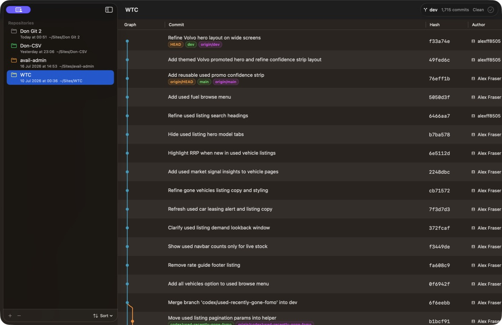
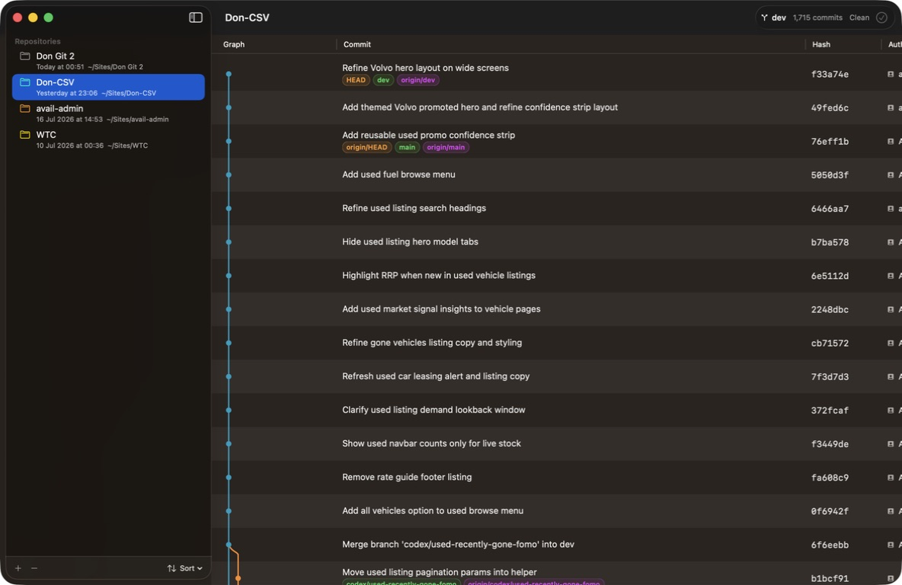

# Don Git 2 commit graph audit

Date: 24 July 2026

Scope: graph construction, rendering, width and overflow, colour use, accessibility, repository switching, ref density, and large-history behaviour. Production source was reviewed without modification. Tests used the real `CommitGraphBuilder` against repositories already present under `~/Sites`, plus deterministic synthetic histories.

## Outcome

The graph is clear and structurally sound for linear and modestly branched histories, but it is not yet reliable for wide or unusual histories. Two high-severity problems can make the visual topology wrong or incomplete: stale parent-lane indexes in a valid merge ordering, and hard clipping above the tenth lane. Repeated colours, missing assistive descriptions, low-contrast light-mode colours, stale data during repository switches, and unbounded all-ref history reduce trust further.

## Screenshots

Current WTC graph state:

Repository transition mismatch—the window and sidebar show Don-CSV while the toolbar and history still show WTC:

## Findings

### P1 — A valid merge can be connected to the wrong parent lane

`CommitGraphBuilder.placeParents` records the lane of an existing parent, then can insert a later parent before it without updating the recorded index. Minimal valid topology:

- Before `X`: lanes `[X, Q, P1]`
- `X` parents: `[P1, P2]`
- After `X`: lanes `[Q, P2, P1]`
- Recorded parent lanes: `[1, 1]`

Both connectors land on `P2`; the `P1` relationship is not drawn correctly. A deterministic property test over 50,000 valid topologically ordered DAGs found at least one invalid parent target in 42,149 generated graphs. The sampled real repositories did not trigger this exact invariant failure, so it is an edge case rather than proof that an existing visible WTC row is wrong.

Affected source: `Services/CommitGraphBuilder.swift`, especially the parent lookup/insertion loop around lines 80–93.

### P1 — Graphs wider than ten lanes are clipped

The store caps fitted width at ten lanes (`10 × 14 + 22 = 162 pt`), while the table separately caps the column at 220 pt. WTC reaches 30 lanes. Its rightmost node is centred at `29 × 14 + 8 = 414 pt`, requiring roughly 420 pt including the node. More than 250 pt of that row therefore falls outside the fitted graph column.

Real-history evidence:

| Repository | Commits | Max lanes | Rows >10 | Rows >16 |
|---|---:|---:|---:|---:|
| WTC | 1,715 | 30 | 480 | 145 |
| WTC_Admin | 325 | 21 | 38 | 21 |
| avail-admin | 325 | 6 | 0 | 0 |
| SBO_Website | 196 | 6 | 0 | 0 |

Affected source: `Stores/GitViewerStore.swift:50–53`, `Views/CommitTable.swift:18–22`, and `Views/CommitGraphView.swift:118–120`.

### P2 — Concurrent lanes reuse colours before the allocator expects them to

The builder allocates unique raw integers, but rendering maps each integer through a 16-colour modulo palette. Raw lanes `0` and `16`, for example, both render cyan. This affected 795 of 1,715 WTC rows (46%) and 73 of 325 WTC_Admin rows (22%). At WTC commit `27378c6`, active raw colours include both `0` and `16`.

Affected source: `Services/CommitGraphBuilder.swift:112–121` and `Support/GitGraphColorPalette.swift:23–25`.

### P2 — Switching repositories temporarily pairs the new title with old history

In a fresh live run, the sidebar selection and window title changed to `Don-CSV` while the toolbar and graph continued to show WTC (`dev`, 1,715 commits and WTC subjects). It later corrected. The store sets `isLoadingHistory`, but the table is replaced by a progress indicator only when `rows` is already empty; old rows remain visible during a non-empty refresh.

Affected source: `Stores/GitViewerStore.swift:74–80`, `Stores/GitViewerStore.swift:206–235`, and `Views/RepositoryHistoryView.swift:32–40`.

### P2 — The graph has no accessibility equivalent

The entire `Canvas` is hidden from accessibility. VoiceOver gets commit text, hashes, refs and authors from the table, but no parent count, merge status, branch continuation, or equivalent graph description. Colour and spatial position are the only visual encodings.

Affected source: `Views/CommitGraphView.swift:12–20`.

### P2 — Several graph colours are too faint in light appearance

Using the hard-coded RGB values, eight of the sixteen colours are below the 3:1 non-text contrast threshold against white; examples include yellow (about 1.45:1), lime (1.77:1), teal (1.88:1), green (2.22:1), and orange (2.37:1). The palette does not adapt to appearance or increased-contrast settings.

Affected source: `Support/GitGraphColorPalette.swift:4–20`.

### P2 — `--all` makes the default graph noisier than the user's likely task

History is loaded with `git log --all --topo-order`, so remote refs, tags, stale branches and stash commits all participate. WTC currently exposes 175 refs and its only octopus commit is a stash commit. WTC_Admin's 21-lane maximum is also a stash commit. An Apple-style scope control such as Current Branch / Local Branches / All Refs would keep the normal view legible while preserving access to the full graph.

Affected source: `Services/GitClient.swift:73–80`.

### P3 — Ref badges disappear silently

The commit summary renders every ref in a one-line fixed-size `HStack` and clips it to the available width. Long names or many refs disappear without a `+N` overflow badge, disclosure, or tooltip.

Affected source: `Views/CommitTable.swift:69–89`.

### P3 — Large histories are loaded eagerly

Every commit from every ref is parsed and graph state stores before/after lane arrays for every row. The isolated history parse and graph audit for WTC plus WTC_Admin (2,040 commits total) completed in 0.34 seconds, so the core builder is presently fast at this scale. The live accessibility inspection repeatedly timed out in the dense WTC section, but that cannot isolate app rendering from tooling overhead. This is a scaling risk, not a confirmed user-facing performance defect.

## What is working well

- `--topo-order` is the right baseline ordering for this display.
- Across 2,737 real commits sampled from six repositories, lane-move invariants held, lanes remained unique, and all histories closed with zero dangling lanes.
- The first-row treatment avoids an incoming line from nowhere.
- Canvas rendering and the native SwiftUI table give linear and small-merge histories a compact, readable presentation.
- The normal WTC screenshot shows good row alignment and clear node-to-commit association in dark appearance.

## Recommended order

1. Fix parent-lane bookkeeping and lock it with the minimal regression case plus generated DAG invariants.
2. Define a deliberate wide-graph strategy: dynamically fit, horizontally scroll/freeze the graph column, or collapse off-screen lanes with an explicit indicator. Silent clipping is not acceptable.
3. Make colour allocation palette-aware and add a secondary cue; adopt semantic/adaptive colours with light, dark, increased-contrast and colour-vision tests.
4. Clear or mask stale rows while loading a newly selected repository, and expose a progress state in the detail area and toolbar.
5. Add history scope and ref overflow controls using stock macOS elements.
6. Add a concise accessibility summary per row, such as “merge commit, 2 parents, lane 3 of 7.”

## Audit limits

- Dark appearance was visually captured. Light appearance and VoiceOver were assessed from source and calculated contrast, not a full hands-on assistive-technology session.
- The live capture tool timed out after scrolling into WTC's dense history, so the 30-lane clipping proof is derived from actual WTC graph state and exact layout constants rather than a screenshot of that row.
- No production files were changed.
