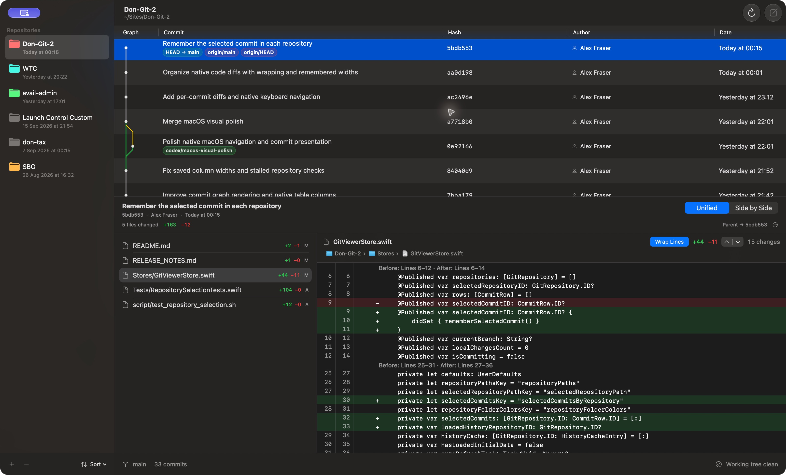
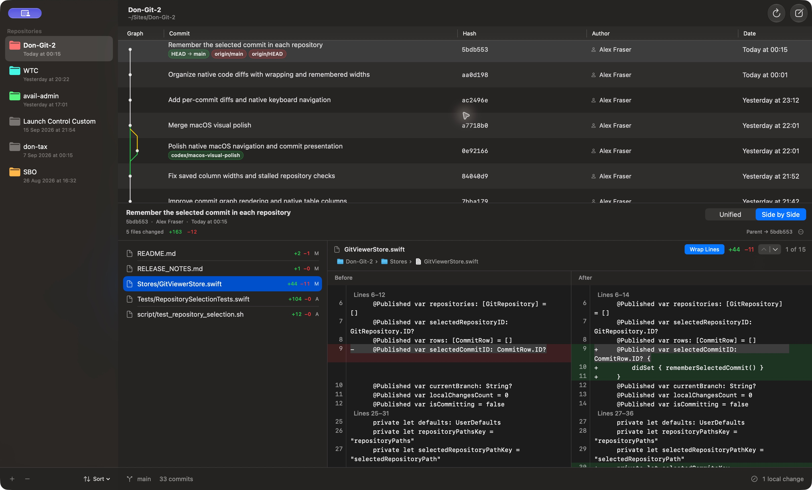
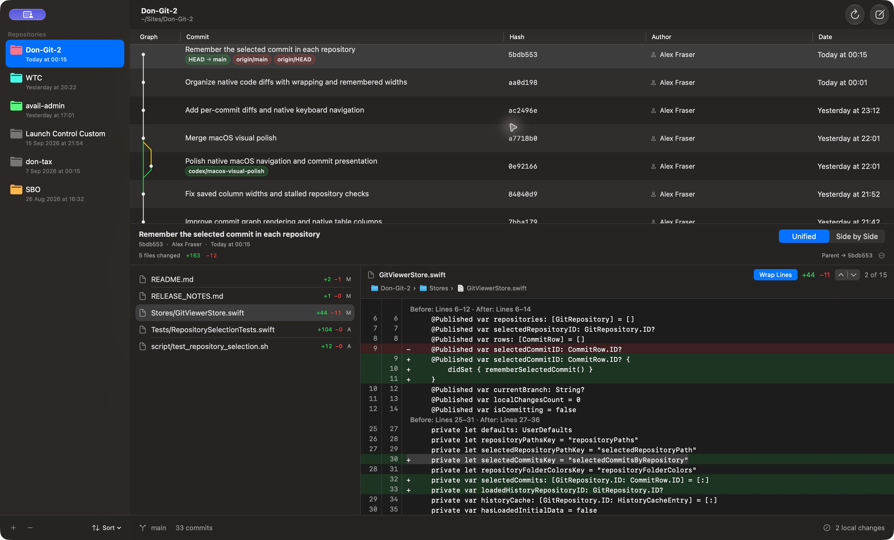

# Don Git 2

**Native commit review, built for macOS.**

Explore your local Git repositories, follow the commit graph, and see exactly what changed in each commit. Don Git 2 uses SwiftUI, AppKit, and standard macOS controls, with keyboard navigation and a workspace that remembers where you left off.



## New in the latest update

| Feature | What it does |
| --- | --- |
| **Changes per commit** | Select a commit to see its changed files, full message, and addition/deletion counts. |
| **Two diff views** | Review one unified diff or compare before and after side by side, with synchronised vertical scrolling. |
| **Keyboard navigation** | Move between repositories, commits, files, and changed blocks using native focus and shortcuts. |
| **Wrap Lines** | Fit long code to the pane while keeping side-by-side rows aligned. Your choice is remembered. |
| **Remembered workspace** | Restore column widths, pane sizes, and the last selected commit in each repository, including after restarting. |

See the [changelog](RELEASE_NOTES.md) for the full update.

## Read the changes, in context

A compact file toolbar keeps **Wrap Lines**, change counts, and previous/next controls close to the code. Native path breadcrumbs show where the file belongs; fixed line-number gutters and plain line ranges help you follow the diff. Select and copy code using the standard macOS text controls.



Compare merge commits against either parent, and root commits against an empty tree. Renames, deletions, additions, binary files, and metadata-only changes have explicit representations.

## Stay in the flow

Click the sidebar, commit history, or changed-file list to focus it. The selected row uses the native blue accent highlight on the pictured system, and arrow keys move through that list. The **Navigate** menu provides shortcuts for moving between panes and changes.

| Action | Shortcut |
| --- | --- |
| Focus repositories / history / changed files / code | ⌘0 / ⌘1 / ⌘2 / ⌘3 |
| Previous / next commit | ⌃⌘↑ / ⌃⌘↓ |
| Previous / next changed file | ⌥⌘↑ / ⌥⌘↓ |
| Previous / next changed block | ⌥⌘← / ⌥⌘→ |
| Add repository | ⌘O |
| Refresh history | ⌘R |
| Submit the commit sheet | ⌘Return |



Switch repositories and return to the commit you were reviewing. Resized history columns and pane dividers also survive app restarts.

## A familiar macOS workspace

- Add repositories through the standard macOS folder picker; any folder inside a Git working tree is accepted.
- Give repository folders persistent colours and sort by name or most recent commit date.
- Follow all branches and refs in a topological commit graph, with branch, remote, and tag badges.
- Read the current branch, commit count, and working-tree status in the bottom bar.
- Refresh history from the native toolbar or File menu.
- Stage and commit all local changes from a multiline commit sheet.

The interface follows system appearance and native macOS conventions, including the macOS 26 / Golden Gate toolbar treatment, while retaining macOS 15 support.

## Build and run

Requires **macOS 15 or later**, **Swift 6.1 or later**, and Git available at `/usr/bin/git`.

```bash
git clone https://github.com/alexff8505/Don-Git-2.git
cd Don-Git-2
bash script/build_and_run.sh
```

The packaged app is written to `dist/Don Git 2.app`. Use `bash script/build_and_run.sh --build` to package without launching, or `swift build` to compile only.

## Checks

The focused checks cover Git history and diffs, native rendering, column persistence, and repository selection memory:

```bash
bash script/test_graph.sh
bash script/test_changes.sh
bash script/test_diff_view.sh
bash script/test_columns.sh
bash script/test_repository_selection.sh
```

[Changelog](RELEASE_NOTES.md) · [Screenshot gallery](Docs/Screenshots/README.md)
