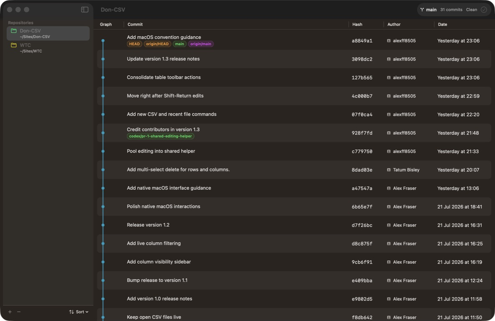

# Don Git 2

Don Git 2 is a native macOS Git history viewer for local repositories. It uses SwiftUI and standard macOS controls to keep repository navigation, commit history, branches, refs, and local changes visible in one window.



## Features

- Add individual Git repositories with the sidebar `+` button or **File → Add Repository…** (`⌘O`).
- Keep added repositories and the last selection between app launches.
- Assign a persistent colour to each repository folder from its right-click menu.
- Sort repositories by name or most recent commit date.
- View all branches and refs in a topological commit graph.
- See the current branch, commit count, and working-tree status in the bottom status bar.
- Refresh history with the native toolbar action or **File → Refresh History** (`⌘R`).
- Stage and commit all local changes with a multiline commit message (`⌘Return` in the commit sheet).

The repository picker uses the standard macOS open panel and accepts any folder inside a Git working tree.

## Requirements

- macOS 15 or later
- Swift 6.1 or later

## Build and run

```bash
./script/build_and_run.sh
```

To compile without creating and launching the app bundle:

```bash
swift build
```

The packaged app is written to `dist/Don Git 2.app`.

## Release notes

See [RELEASE_NOTES.md](RELEASE_NOTES.md) for the latest changes.
